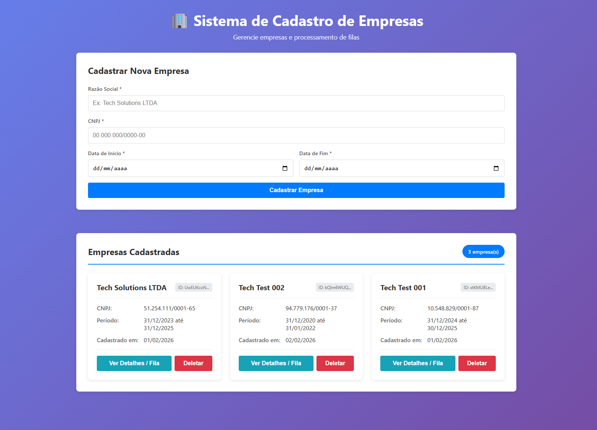
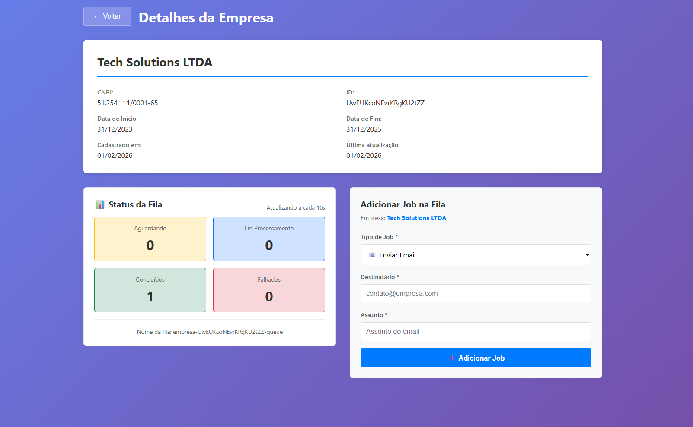

# 🏢 Sistema de Cadastro de Empresas com Filas

Sistema completo para cadastro de empresas e processamento assíncrono usando filas.

## 🚀 Tecnologias

### Backend

- Node.js + TypeScript
- Express.js
- Firebase Firestore
- Redis + BullMQ
- Docker

### Frontend

- React + TypeScript
- React Router
- Axios

  ## 📸 Screenshots

  ### Tela Principal

  

  ### Detalhes e Fila

  

## 📋 Pré-requisitos

- Node.js 18+
- Docker Desktop
- Conta Firebase (gratuita)

## ⚙️ Configuração

### 1. Clone o repositório

```bash
git clone https://github.com/servuloccsilva/desafio-hsbconsultoria.git
cd desafio-hsbconsultoria
```

### 2. Configure o Firebase

1. Crie um projeto em https://console.firebase.google.com/
2. Ative o Firestore
3. Baixe o `serviceAccountKey.json`
4. Coloque em `backend/serviceAccountKey.json`

### 3. Configure as variáveis de ambiente

**Backend (`backend/.env`):**

```env
PORT=3001
NODE_ENV=development
FIREBASE_PROJECT_ID=seu-projeto-id
REDIS_HOST=localhost
REDIS_PORT=6379
FRONTEND_URL=http://localhost:3000
```

**Frontend (`frontend/.env`):**

```env
REACT_APP_API_URL=http://localhost:3001/api
```

### 4. Suba o Redis

```bash
docker-compose up -d
```

### 5. Instale as dependências

**Backend:**

```bash
cd backend
npm install
```

**Frontend:**

```bash
cd frontend
npm install
```

## 🎯 Como Executar

### Backend

```bash
cd backend
npm run dev
```

Servidor rodará em: http://localhost:3001

### Frontend

```bash
cd frontend
npm start
```

Aplicação abrirá em: http://localhost:3000

## 📚 API Endpoints

### Empresas

- `POST /api/empresas` - Criar empresa
- `GET /api/empresas` - Listar empresas
- `GET /api/empresas/:id` - Buscar empresa
- `PUT /api/empresas/:id` - Atualizar empresa
- `DELETE /api/empresas/:id` - Deletar empresa

### Filas

- `POST /api/empresas/:id/jobs` - Adicionar job
- `GET /api/empresas/:id/jobs?status=waiting` - Listar jobs
- `GET /api/empresas/:id/queue-status` - Status da fila

## 🧪 Testando

### Exemplo de requisição (criar empresa):

```bash
curl -X POST http://localhost:3001/api/empresas \
  -H "Content-Type: application/json" \
  -d '{
    "razaoSocial": "Tech Solutions LTDA",
    "cnpj": "12.345.678/0001-90",
    "dataInicio": "2024-01-01T00:00:00.000Z",
    "dataFim": "2025-12-31T23:59:59.000Z"
  }'
```

### Exemplo de requisição (adicionar job):

```bash
curl -X POST http://localhost:3001/api/empresas/SEU_ID/jobs \
  -H "Content-Type: application/json" \
  -d '{
    "tipo": "enviar-email",
    "dados": {
      "destinatario": "contato@empresa.com",
      "assunto": "Bem-vindo!"
    }
  }'
```

## 📂 Estrutura do Projeto

```
desafio-empresas/
├── backend/
│   ├── src/
│   │   ├── config/          # Configurações (Firebase, Redis, Express)
│   │   ├── controllers/     # Controladores
│   │   ├── services/        # Lógica de negócio
│   │   ├── routes/          # Rotas da API
│   │   ├── queues/          # Gerenciamento de filas
│   │   ├── types/           # Tipos TypeScript
│   │   ├── utils/           # Utilitários
│   │   └── server.ts        # Arquivo principal
│   ├── .env
│   └── package.json
│
├── frontend/
│   ├── src/
│   │   ├── components/      # Componentes React
│   │   ├── pages/           # Páginas
│   │   ├── services/        # Services de API
│   │   ├── types/           # Tipos TypeScript
│   │   ├── utils/           # Utilitários
│   │   └── App.tsx
│   ├── .env
│   └── package.json
│
├── docker-compose.yml
└── README.md
```

## 🎨 Funcionalidades

- ✅ Cadastro de empresas com validação de CNPJ
- ✅ Criação automática de fila para cada empresa
- ✅ Adicionar jobs nas filas
- ✅ Processamento assíncrono com BullMQ
- ✅ Monitoramento de status das filas
- ✅ Interface React responsiva
- ✅ Validações completas frontend e backend

## 📝 Licença

MIT

## 👨‍💻 Autor

[Sérvulo Silva]
